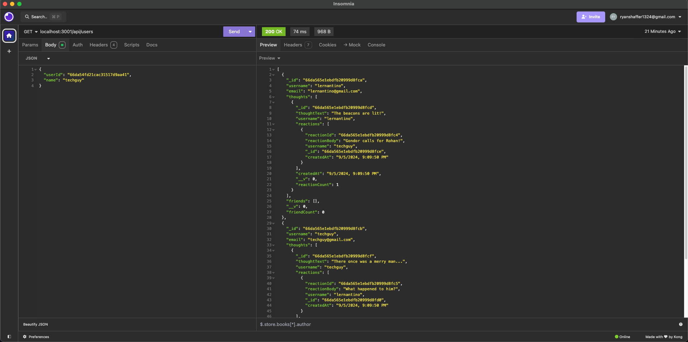

# Mongo-blog

## Description
This is a demonstration of the backend of an application with a noSQL database.

## Table of contents
- [Usage](#usage)
- [Contributing](#contributing)
- [Questions](#questions)
- [Contact](#contact)

## Usage
This project is intended for those learning how to code, especially with various database paradigms. This project utilized noSQL.

## Contributing
This project is open to contribution. One can pull this project to their local device, make an edit, and push it up the main branch. Act fast for tha tmay not always be the case!

## License
  
Notice: This project is licensed with a MIT license. More information pertaining to the given license is provided in the link below.  
https://www.mit.edu/~amini/LICENSE.md

## Questions
Github username: shyanrafer  
Github profile link: https://github.com/shyanrafer  
Repo link: https://github.com/shyanrafer/mongo-blog
Demo video link: https://app.screencastify.com/v2/manage/videos/9pdjorCzL282NsLuC0Yp

## Contact
Best mode of contact: Email  
Contact info: ryanshaffer1324@gmail.com  
 
[Back to top](#Mongo-blog)

## Screenshot
